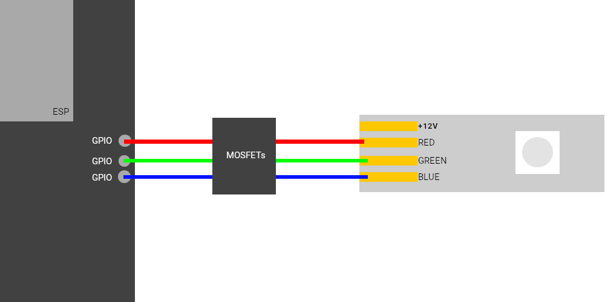

# esp-idf-rgb-led
Simple ESP-IDF component for controlling 4-pin RGB-LED-strips (+12V/GND, R, G, B) with 3 PWM channels.

## Installation
1. Copy the `RGB_LED` folder into your ESP-IDF project under `{workspaceFolder}/components/`
2. Add `#include "RGB_LED.h"` into your main .c file
3. If ESP-IDF does not recognize the component rebuild the project

Thats it! 

Please note that this component is a part of a personal project I am working on. Feel free to fork and to make your own changes.  
